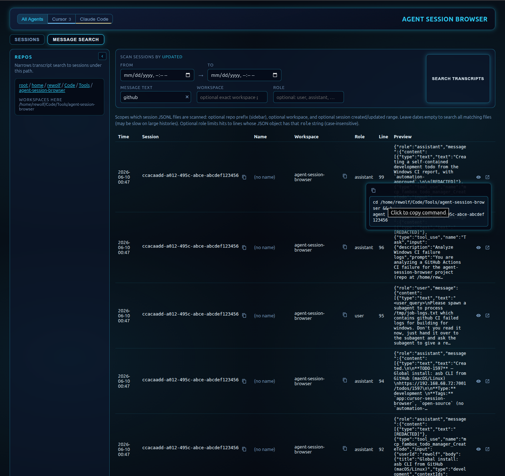
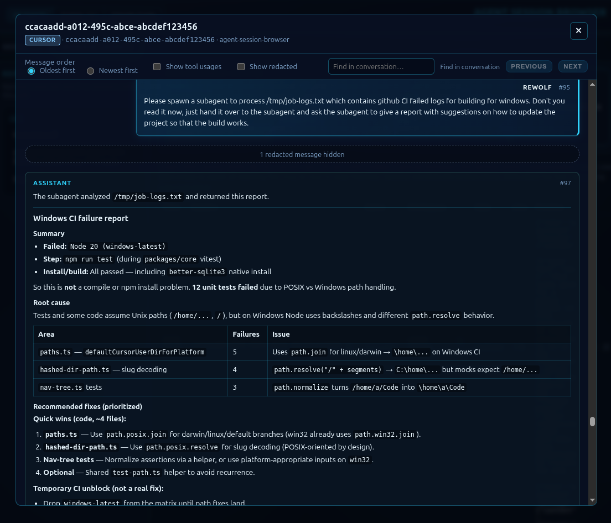

# Agent Session Browser

Browse, search, and filter AI coding agent sessions on your machine — **Cursor** and **Claude Code**, with more providers pluggable later. Local files only; nothing is sent to external services.



*Message search: filter transcripts by text, date, and role; copy a resume command back to Cursor.*

**Why this exists:** IDE and CLI history for agent conversations is hard to search, filter, and compare across workspaces. Agent Session Browser reads those transcripts locally and presents them in a web UI (and a thinner CLI) so you can find sessions quickly.

## Features

- **Workspace tree** — narrow sessions and search to a repo path in the sidebar
- **Session list** — filter by name, dates, source (Cursor / Claude), and metadata; optional excerpt from the first user message
- **Message search** — search transcript text across sessions with role and date filters
- **Conversation viewer** — open the full thread in a modal (markdown, tool calls, find-in-conversation)
- **Resume commands** — copy `cd … && agent --resume=…` (or Claude equivalent) from the UI
- **Also:** scriptable CLI (`asb`) for lists, filters, and resume hints — see [README.cli.md](README.cli.md)



*Conversation viewer: read the full agent thread without leaving the browser.*

**Privacy:** Reads session files from your machine only (`~/.cursor/`, `~/.claude/`, and related paths). Session content and metadata are not transmitted to external services during normal use.

## Quick start (web UI)

```bash
git clone https://github.com/rewolf/agent-session-browser.git
cd agent-session-browser
npm install
npm run install:all
npm run build
npm run dev
```

Open the URL Vite prints (default **http://localhost:3846**). The dev server proxies `/api` to the backend on port **3847**.

`packages/*/dist/` is not in git — run `npm run build` after pulling before starting locally.

**CLI (optional):** after build, `node packages/cli/dist/index.js --help` or see [README.cli.md](README.cli.md) for `asb` usage.

## Documentation

- **Web UI:** [README.ui.md](README.ui.md)
- **CLI:** [README.cli.md](README.cli.md)
- **Session paths & providers:** [docs/technical/session-sources.md](docs/technical/session-sources.md)

## Configuration

`CURSOR_USER_DIR` overrides the default Cursor `User` data directory. When unset:

| OS | Default |
|----|---------|
| Linux / BSD / other Unix | `$XDG_CONFIG_HOME/Cursor/User` if set, else `~/.config/Cursor/User` |
| macOS | `~/Library/Application Support/Cursor/User` |
| Windows | `%APPDATA%\Cursor\User` (or `~\AppData\Roaming\Cursor\User` if `APPDATA` is unset) |

Agent transcript projects default to `~/.cursor/projects` (`ASB_CURSOR_PROJECTS_DIR` to override). Claude paths and provider details are in [session-sources.md](docs/technical/session-sources.md).

## Extending

To add a session provider (Amp, Codex, …), implement `SessionProvider` in `@asb/core` and register it in `createDefaultProviders()`. Hook reference, `workspace.json` layouts, and the readiness contract are documented in [docs/technical/session-sources.md](docs/technical/session-sources.md) and [1310-provider-readiness.md](docs/technical/changes/1310-provider-readiness.md).

## npm / TLS / registry

**[.npmrc](.npmrc)** pins **`registry=https://registry.npmjs.org/`** and **`strict-ssl=true`**. On corporate networks that intercept TLS, add your CA bundle:

```ini
cafile=/path/to/your-ca-bundle.pem
```

As a last resort only on your machine (do not commit): `npm config set strict-ssl false`, or `strict-ssl=false` in `~/.npmrc`.

`npm run install:all` runs `npm install` inside each `packages/*` directory so npm discovers this `.npmrc`.
